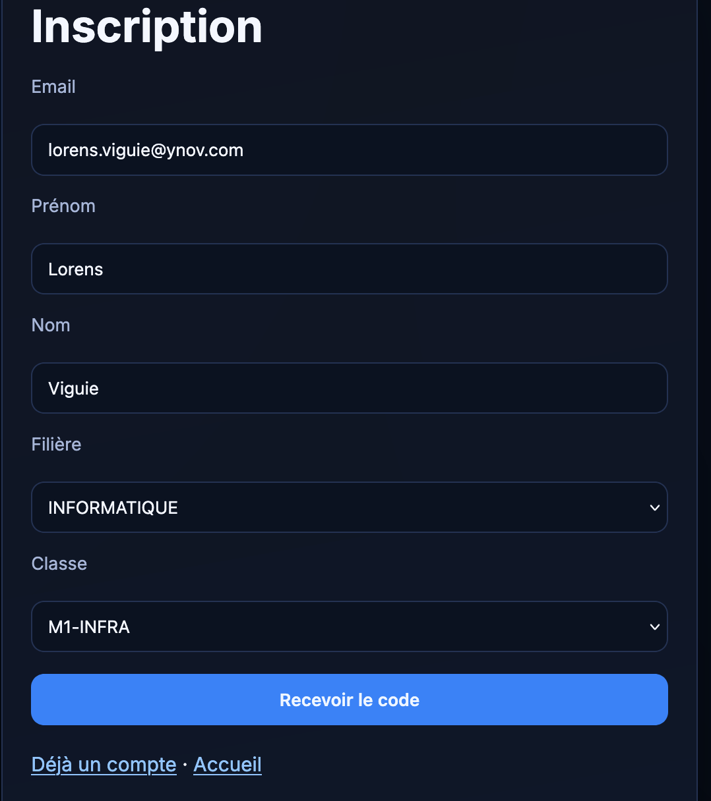
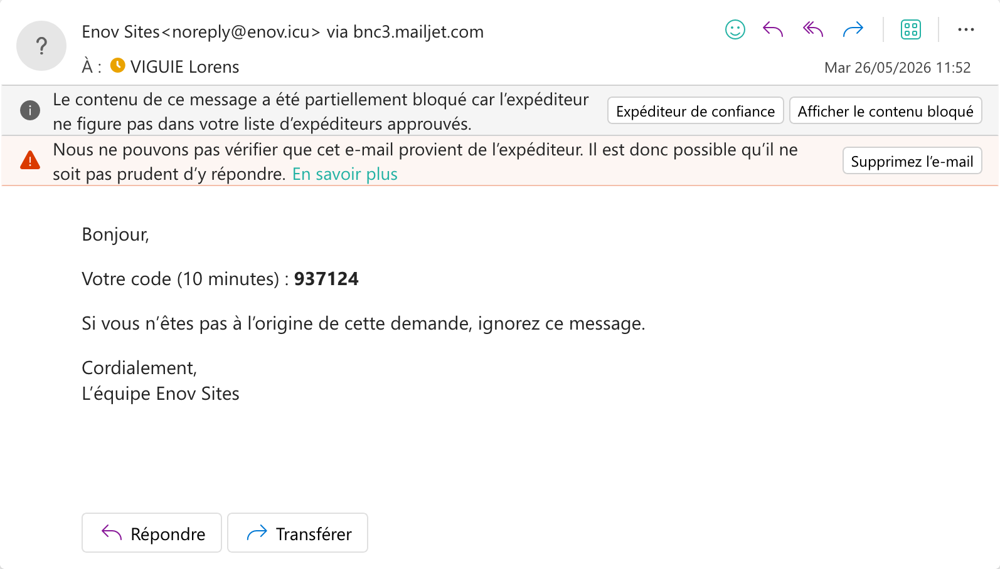

# Procédure : Création de compte sur enov.icu

Ce guide vous explique étape par étape comment créer et activer votre compte sur la plateforme **enov.icu**.

---

## 📋 Prérequis
Avant de commencer, munissez-vous de :
* Votre adresse email institutionnelle **Ynov** (`@ynov.com`).
* Vos informations personnelles (Nom, Prénom, Filière).

---

## 🛠️ Étapes de création du compte

### Étape 1 : Accéder au site
1. Ouvrez votre navigateur web.
2. Rendez-vous sur le site : [enov.icu](https://enov.icu) (ou cliquez directement sur le lien).

### Étape 2 : Renseigner les informations d'inscription
Sur la page d'inscription, complétez le formulaire avec les informations suivantes :
* **Email :** Saisissez votre adresse mail **Ynov**.
* **Nom :** Votre nom de famille.
* **Prénom :** Votre prénom.
* **Filière :** Sélectionnez ou renseignez votre filière d'étude.
* **Mot de passe :** Choisissez un mot de passe sécurisé et mémorisez-le.

### Étape 3 : Vérification de l'adresse email
1. Après avoir validé le formulaire, consultez la boîte de réception de votre adresse mail Ynov.
2. Vous allez recevoir un **code de vérification** par mail.
3. Copiez ce code et saisissez-le sur le site pour valider définitivement votre inscription.

---

## 🔑 Connexion au compte

Une fois votre compte validé et activé :
1. Retournez sur la page de connexion de [enov.icu](https://enov.icu).
2. Connectez-vous en utilisant votre **adresse mail Ynov** et le **mot de passe** que vous avez choisi lors de l'inscription.
