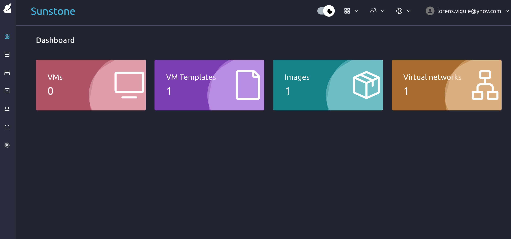
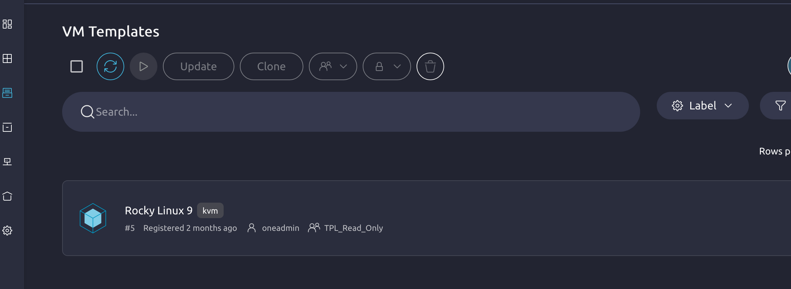
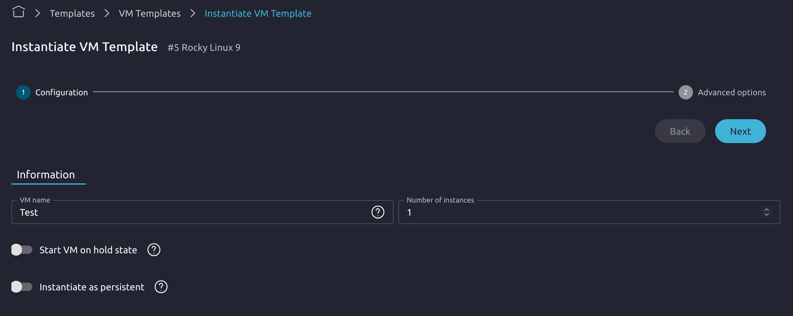
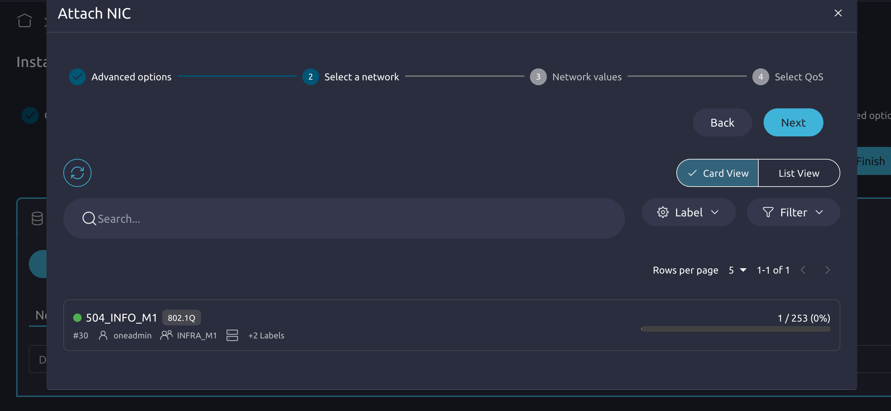
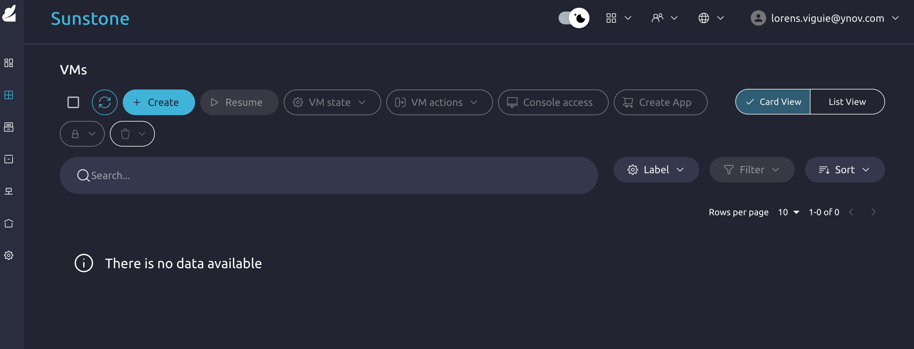

# Procédure : Création d'une Machine Virtuelle (VM) sur OpenNebula

Ce guide vous explique pas à pas comment déployer une machine virtuelle (VM) en utilisant l'interface **OpenNebula**.

---

## 📋 Prérequis
Avant de commencer, assurez-vous d'être connecté au réseau requis (via le VPN NetBird si vous êtes à distance) afin de pouvoir résoudre le domaine local.

⚠️ **PRÉLUDE OBLIGATOIRE :** Avant de pouvoir instancier et déployer votre machine virtuelle, **vous devez impérativement ajouter votre clé SSH publique** à votre profil. Sans cette configuration préalable, il vous sera impossible de vous connecter à distance et de prendre la main sur votre VM une fois celle-ci créée.

[Ajouter une clé public](./Nebula_Add_SSH_Key.md)

---

## 🛠️ Étapes de création de la VM

### Étape 1 : Connexion au portail Nebula
1. Ouvrez votre navigateur web.
2. Rendez-vous sur l'URL suivante : [http://nebula.cloud.enov.local:2616](http://nebula.cloud.enov.local:2616)

---

### Étape 2 : Accéder aux Templates
1. Dans le menu ou le bandeau horizontal, cliquez sur l'onglet **Template**.

---

### Étape 3 : Instancier le Template
1. Cliquez sur le **seul template (tpl) disponible** dans la liste pour le sélectionner.
2. Cliquez sur l'icône en forme de bouton de lecture en haut de l'interface (**Instantiate**).

---

### Étape 4 : Configurer la VM (Nom et Ressources)
1. Remplissez le formulaire de configuration avec les informations suivantes :
   * **Nom :** Donnez un nom clair et identifiable à votre VM.
   * **CPU :** Allouez la puissance nécessaire.
   * **RAM :** Définissez la quantité de mémoire vive.

⚠️ *Attention : Veillez à bien respecter vos quotas disponibles pour ne pas bloquer la création.*

---

### Étape 5 : Configuration Réseau (Attach NIC)
1. Toujours dans le formulaire de création, ouvrez les **Paramètres avancés**.
2. Allez dans la section **Réseau** (ou *Network*), puis cliquez sur **Attach NIC**.
3. Choisissez le **seul réseau disponible** qui vous est attribué.

---

### Étape 6 : Finalisation
1. Une fois toutes les informations renseignées, cliquez sur le bouton **Finish**.
2. Cela va lancer la création de votre VM. Vous pourrez suivre son statut ("Running") dans l'onglet des instances.

