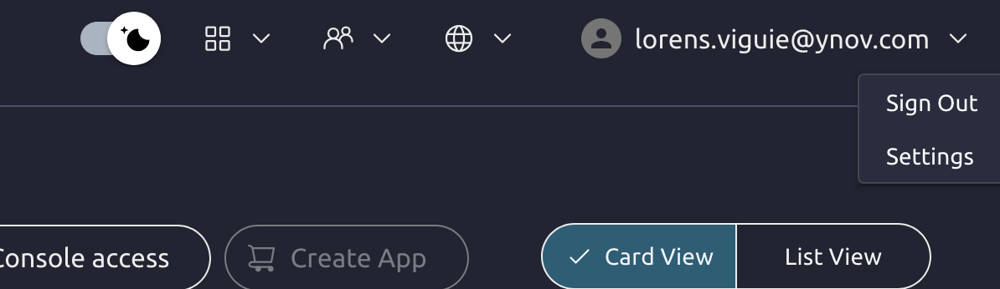
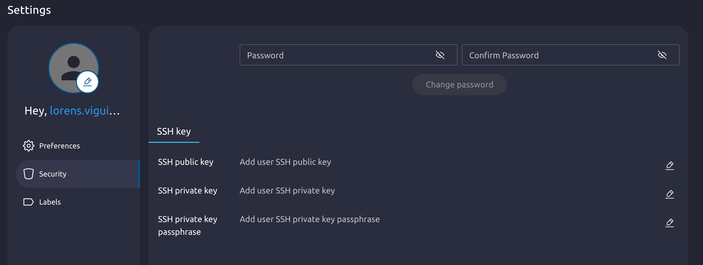

---

## 🔑 Étape importante : Ajout de votre clé SSH publique

⚠️ **PRÉLUDE OBLIGATOIRE :** Avant de pouvoir instancier et déployer votre machine virtuelle, **vous devez impérativement ajouter votre clé SSH publique** à votre profil. Sans cette configuration préalable, il vous sera impossible de vous connecter à distance et de prendre la main sur votre VM une fois celle-ci créée.

### Étape 1 : Accéder aux paramètres du compte
1.Rendez-vous sur l'URL suivante : [http://nebula.cloud.enov.local:2616](http://nebula.cloud.enov.local:2616)   
2. Une fois connecté sur le portail Nebula, cliquez sur votre nom d'utilisateur ou l'icône de profil en haut à droite.   
3. Dans le menu déroulant, sélectionnez **Settings** (Paramètres du compte).



### Etape 1 Bis :

Generéer une clé ssh :
```sh
ssh-keygen -t ed25519
# for legacy system
ssh-keygen -t rsa -b 4096
```

### Étape 2 : Ajouter la clé publique
1. Dans l'onglet de configuration de votre profil, recherchez la section dédiée aux clés SSH.
2. Cliquez sur le bouton permettant d'ajouter une nouvelle clé (**Add SSH Key**).
3. Donnez un nom à votre clé (par exemple, "Mon PC Fixe") et collez le contenu de votre clé publique (généralement le contenu de votre fichier `.pub`).
4. Validez pour enregistrer la clé sur votre compte.



---
