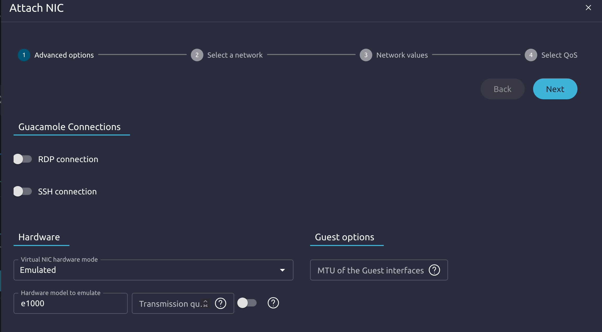

# Documentation : Configuration Réseau et Contextualisation de Windows Server 2022 sous OpenNebula

Cette documentation détaille les étapes pour ajouter et configurer correctement une carte réseau émulée pour une machine virtuelle Windows Server 2022 dans OpenNebula, ainsi que l'installation du package de contextualisation.

---

## Étape 1 : Configuration de la carte réseau dans OpenNebula (Sunstone)

Avant de démarrer la machine virtuelle, il est nécessaire de lui associer une carte réseau avec un profil de matériel que Windows peut reconnaître nativement.

1. Connectez-vous à l'interface **OpenNebula Sunstone**.
2. Éteignez la machine virtuelle si elle est en cours d'exécution (*Poweroff*).
3. Allez dans le menu **Templates** > **VMs** (ou directement dans la configuration de la VM éteinte) et cliquez sur **Update / Modifier**.
4. Rendez-vous dans l'onglet **Network** (Réseau).
5. Ajoutez ou modifiez la carte réseau existante en configurant les options suivantes :
   * **Virtual NIC Hardware Mode** : Sélectionnez `Emulated`.
   * **Hardware model to emulate** : Saisissez ou sélectionnez `e1000` (ce mode simule une carte Intel standard reconnue nativement par Windows Server 2022).

*Pensez à sauvegarder les modifications avant de démarrer la VM.*

---

## Étape 2 : Validation de la carte réseau sous Windows

1. Démarrez la machine virtuelle depuis OpenNebula et ouvrez la console VNC.
2. Connectez-vous à la session Windows avec les identifiants suivants :
   * **Utilisateur** : `Administrateur`
   * **Mot de passe** : `Scoubidou1&`

> **[INSERER CAPTURE D'ÉCRAN : Écran de connexion Windows ou Bureau Windows ouvert]**

3. Faites un clic droit sur le menu Démarrer et ouvrez le **Gestionnaire de périphériques** (*Device Manager*).
4. Déroulez la section **Cartes réseau** (*Network adapters*). La carte réseau émulée Intel (e1000) doit apparaître comme fonctionnelle et active, sans triangle jaune.

> **[INSERER CAPTURE D'ÉCRAN : Gestionnaire de périphériques Windows avec la carte réseau active]**

---

