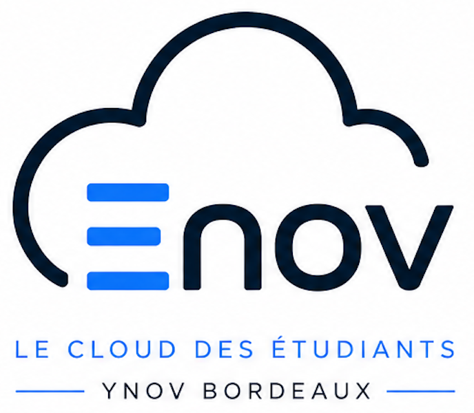

# Plateforme Énov - Guide de Configuration Global

Bienvenue sur le dépôt de documentation de la plateforme **Énov**. Ce projet regroupe l'ensemble des guides et procédures nécessaires pour configurer votre environnement et déployer vos ressources.

  

---

## 📚 Liste des Procédures Disponibles

Pour démarrer sur la plateforme, veuillez suivre les guides dans l'ordre suivant :

1. 👤 [Création de Compte](Procédure/Create_Account.md)  
   *Guide pour s'inscrire sur la plateforme avec vos identifiants institutionnels.*

2. 🔑 [Configuration du VPN NetBird](Procédure/SetupVPN.md)  
   *Étapes de connexion et d'installation du client VPN pour accéder au réseau privé.*

3. 🔒 [Ajout d'une Clé SSH](Procédure/Nebula_Add_SSH_Key.md)  
   *Étape obligatoire pour associer votre clé publique à votre compte avant de déployer des ressources.*

4. 🖥️ [Création d'une Machine Virtuelle](Procédure/Create_VM.md)  
   *Procédure pas à pas pour déployer et configurer votre VM sur OpenNebula.*

---

## 📈 Évolutions futures
*De nouvelles procédures et documentations techniques seront ajoutées à ce dossier au fur et à mesure des évolutions de la plateforme Énov.*
